# 后端系统实现文档
[TOC]
## 1. 系统架构

### 1.1 整体架构

系统采用分层架构设计，主要分为以下几个层次：

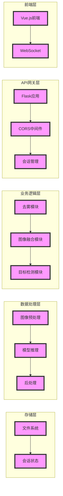

#### 1.1.1 前端层
- 基于Vue.js开发的单页面应用
- 使用WebSocket实现实时状态更新
- 提供用户友好的图像上传和处理界面

#### 1.1.2 API网关层
- 基于Flask框架的RESTful API服务
- 实现CORS跨域资源共享
- 提供会话管理和状态追踪
- 处理请求验证和错误处理

#### 1.1.3 业务逻辑层
- 模块化设计，各功能模块独立
- 实现核心业务处理流程
- 提供模块间的数据流转

#### 1.1.4 数据处理层
- 负责图像预处理和后处理
- 管理深度学习模型推理
- 实现数据格式转换和验证

#### 1.1.5 存储层
- 管理文件系统存储
- 维护会话状态信息
- 处理临时文件和结果存储

#### 1.1.6 系统组件关系

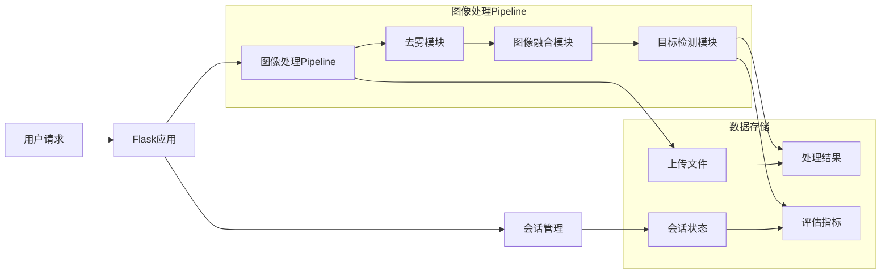

#### 1.1.7 目录结构

```
backend/
├── app.py              # Flask应用主入口
├── config.py           # 配置文件
├── requirements.txt    # 依赖包列表
├── log.txt            # 日志文件
│
├── dehazing/          # 去雾模块
│   ├── __init__.py
│   ├── dehaze.py      # 去雾核心实现
│   ├── net.py         # 网络模型定义
│   ├── dataloader.py  # 数据加载器
│   └── snapshots/     # 模型权重
│
├── fusion/            # 图像融合模块
│   ├── __init__.py
│   ├── fusion.py      # 融合核心实现
│   ├── models/        # 模型定义
│   └── best_model_epoch42.pth  # 预训练模型
│
├── detect/            # 目标检测模块
│   ├── __init__.py
│   ├── detect.py      # 检测核心实现
│   └── yolo11x.pt     # YOLO模型权重
│
├── uploads/           # 上传文件存储
│   ├── thermal/       # 热成像存储
│   └── infrared/      # 红外图像存储
│
└── results/           # 处理结果存储
    ├── dehazed/       # 去雾结果
    ├── fused/         # 融合结果
    └── detected/      # 检测结果
```

#### 1.1.8 数据流转

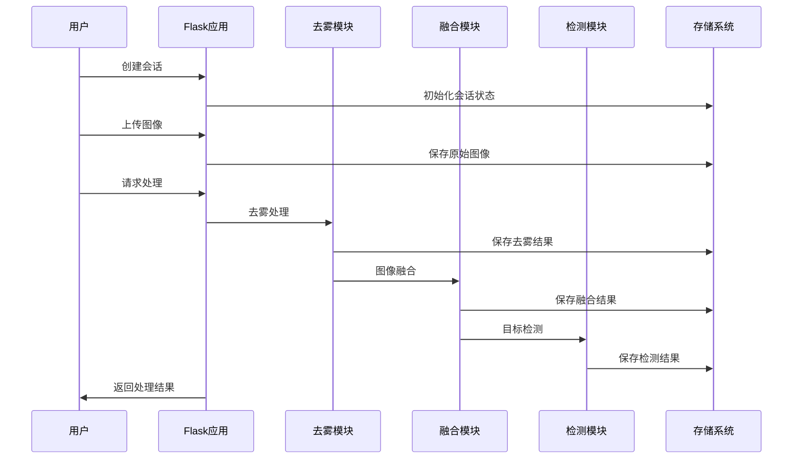

#### 1.1.9 技术栈

##### 1.1.9.1 后端框架
- Flask: Web应用框架
- Flask-CORS: 跨域资源共享
- APScheduler: 后台任务调度

##### 1.1.9.2 深度学习框架
- PyTorch: 深度学习框架
- CUDA: GPU加速支持
- OpenCV: 图像处理

##### 1.1.9.3 存储系统
- 文件系统: 图像和结果存储
- 内存: 会话状态管理
- 日志系统: 运行状态记录

##### 1.1.9.4 开发工具
- Python 3.12.4
- Git
- PyCharm

#### 1.1.10 系统特点

##### 1.1.10.1 模块化设计
- 各功能模块独立封装
- 接口标准化
- 易于扩展和维护

##### 1.1.10.2 高性能
- GPU加速支持
- 异步处理机制
- 内存优化管理

##### 1.1.10.3 可扩展性
- 模块化架构
- 标准化接口
- 配置化管理

##### 1.1.10.4 可维护性
- 清晰的代码结构
- 完整的日志系统
- 异常处理机制

## 2. 核心模块

### 2.1 去雾模块 (Dehazing)

#### 2.1.1 功能描述
去雾模块主要负责对输入的红外图像进行去雾处理，提高图像清晰度和可见性。该模块采用深度学习模型，能够有效去除图像中的雾气和烟雾干扰。

#### 2.1.2 核心组件

##### 2.1.2.1 网络模型 (dehaze_net)
```python
class dehaze_net(nn.Module):
    def __init__(self):
        super(dehaze_net, self).__init__()
        # 编码器
        self.encoder = nn.Sequential(
            nn.Conv2d(3, 64, kernel_size=3, padding=1),
            nn.ReLU(inplace=True),
            nn.Conv2d(64, 64, kernel_size=3, padding=1),
            nn.ReLU(inplace=True)
        )
        # 解码器
        self.decoder = nn.Sequential(
            nn.Conv2d(64, 3, kernel_size=3, padding=1),
            nn.Sigmoid()
        )
```

#### 2.1.2.2 图像处理流程
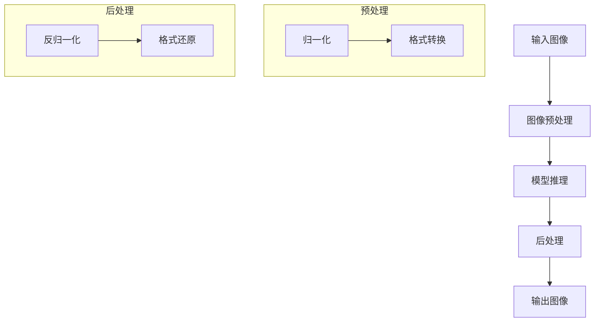

#### 2.1.3 评估指标
- **原始梯度值**：反映输入图像的清晰度
- **去雾后梯度值**：反映处理后图像的清晰度
- **处理时间**：记录去雾处理耗时
- **改善比例**：计算清晰度提升程度

#### 2.1.4 接口定义
```python
def start_dehaze(input_path: str, output_path: str) -> dict:
    """
    对输入图像进行去雾处理
    
    Args:
        input_path: 输入图像路径
        output_path: 输出图像路径
        
    Returns:
        dict: 包含处理结果的字典
            - original_gradient: 原始梯度值
            - dehazed_gradient: 去雾后梯度值
            - processing_time: 处理时间
            - improvement_ratio: 改善比例
    """
```

### 2.2 图像融合模块 (Fusion)

#### 2.2.1 功能描述
图像融合模块将热成像和红外图像进行智能融合，生成包含两种图像优势信息的融合图像。该模块采用注意力机制和残差网络，确保融合效果的最优化。

#### 2.2.2 核心组件

##### 2.2.2.1 融合模型架构
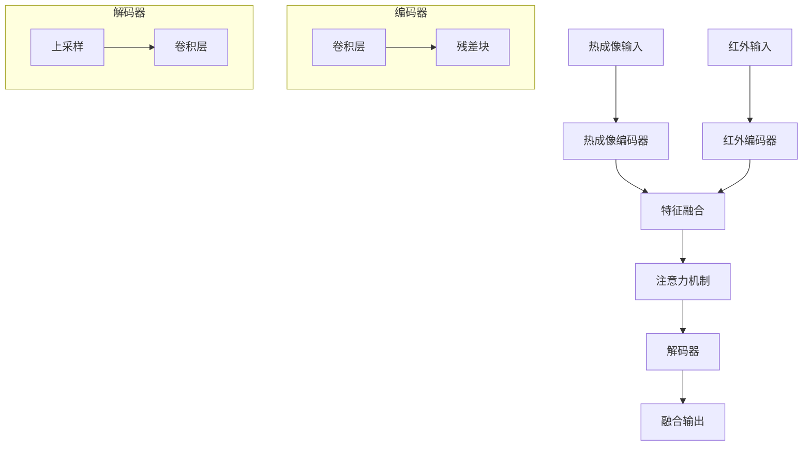

#### 2.2.2.2 关键组件
- **通道注意力机制**：自适应特征权重
- **残差块**：保持特征信息
- **特征融合层**：多尺度特征融合

#### 2.2.3 评估指标
- **空间频率**：评估图像细节保持
- **互信息**：评估信息保留程度
- **处理时间**：记录融合处理耗时

#### 2.2.4 接口定义
```python
def inference_single_image(
    thermal_path: str,
    ir_path: str,
    output_path: str,
    model_path: str = MODEL_PATH,
    device: str = 'cuda'
) -> dict:
    """
    对单对图像进行融合处理
    
    Args:
        thermal_path: 热成像路径
        ir_path: 红外图像路径
        output_path: 输出路径
        model_path: 模型路径
        device: 计算设备
        
    Returns:
        dict: 包含融合结果的字典
            - spatial_frequency: 空间频率
            - mutual_information: 互信息
            - processing_time: 处理时间
    """
```

### 2.3 目标检测模块 (Detect)

#### 2.3.1 功能描述
目标检测模块基于YOLO模型，对融合后的图像进行目标检测，识别和定位图像中的目标物体。该模块支持多类别检测，并提供详细的检测结果和评估指标。

#### 2.3.2 核心组件

#### 2.3.2.1 检测流程
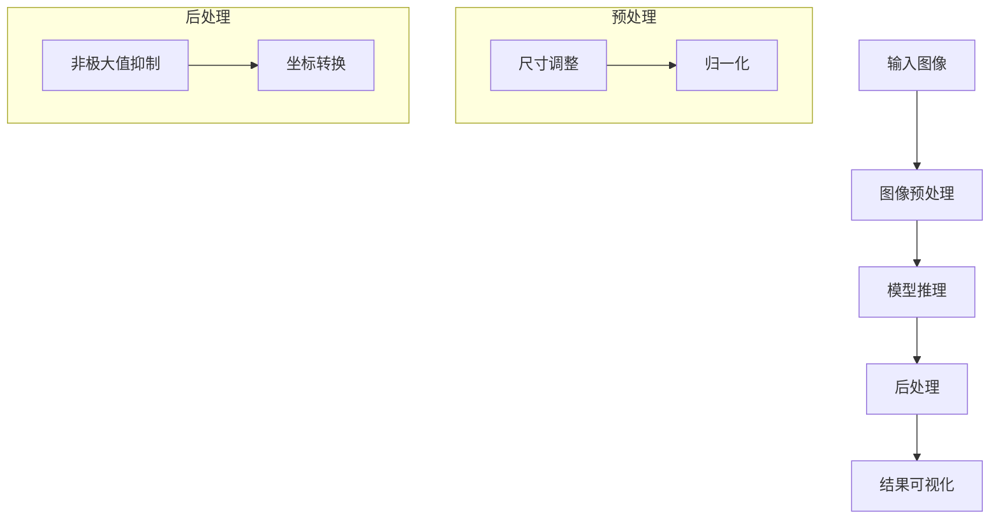

#### 2.3.2.2 评估系统
- **检测评估器**：计算检测性能
- **PR计算器**：生成精确率-召回率曲线
- **可视化器**：结果可视化展示

### 2.3.3 评估指标
- **检测置信度**：目标检测的可信度
- **精确率-召回率**：检测性能评估
- **平均精度(AP)**：综合性能指标

### 2.3.4 接口定义
```python
def detect_single_image(
    img_path: str,
    output_path: str,
    model_path: str = MODEL_PATH
) -> dict:
    """
    对单张图像进行目标检测
    
    Args:
        img_path: 输入图像路径
        output_path: 输出图像路径
        model_path: 模型路径
        
    Returns:
        dict: 包含检测结果的字典
            - detections: 检测框列表
            - confidence: 置信度列表
            - class_ids: 类别ID列表
            - processing_time: 处理时间
    """
```

### 2.4 模块间交互

#### 2.4.1 数据流转
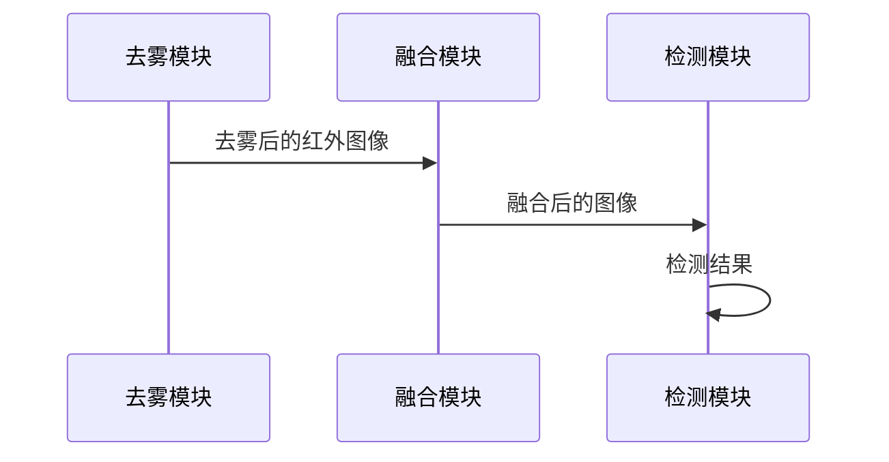

#### 2.4.2 状态管理
- 模块间通过文件系统传递数据
- 使用会话ID跟踪处理状态
- 保持处理结果的完整性

#### 2.4.3 错误处理
- 模块级异常捕获
- 状态回滚机制
- 错误日志记录

好的，我来帮您完善API接口部分的文档。

## 3. API接口

### 3.1 接口概述

系统提供RESTful API接口，采用JSON格式进行数据交换。所有接口都支持CORS跨域请求，并实现了统一的错误处理机制。

#### 3.1.1 基础URL
```
http://localhost:5000
```

#### 3.1.2 通用响应格式
```json
{
    "status": "success/error",
    "message": "操作结果描述",
    "data": {
        // 具体数据
    }
}
```

#### 3.1.3 错误码说明
| 错误码 | 说明 |
|--------|------|
| 200 | 请求成功 |
| 400 | 请求参数错误 |
| 401 | 未授权 |
| 404 | 资源不存在 |
| 500 | 服务器内部错误 |

### 3.2 会话管理接口

#### 3.2.1 创建会话
```http
POST /create-session
```

##### 请求参数
无

##### 响应示例
```json
{
    "status": "success",
    "message": "Session created successfully",
    "data": {
        "session_id": "550e8400-e29b-41d4-a716-446655440000",
        "created_at": "2024-03-20T10:00:00Z"
    }
}
```

##### 错误响应
```json
{
    "status": "error",
    "message": "Failed to create session",
    "error": "具体错误信息"
}
```

### 3.3 图像上传接口

#### 3.3.1 上传图像
```http
POST /upload
```

##### 请求参数
| 参数名 | 类型 | 必填 | 说明 |
|--------|------|------|------|
| file | File | 是 | 图像文件 |
| type | String | 是 | 图像类型(infrared/thermal) |
| session_id | String | 是 | 会话ID |

##### 请求示例
```python
import requests

files = {'file': open('image.jpg', 'rb')}
data = {
    'type': 'infrared',
    'session_id': '550e8400-e29b-41d4-a716-446655440000'
}
response = requests.post('http://localhost:5000/upload', files=files, data=data)
```

##### 响应示例
```json
{
    "status": "success",
    "message": "infrared image uploaded successfully",
    "data": {
        "filename": "550e8400-e29b-41d4-a716-446655440000_infrared.jpg",
        "type": "infrared",
        "session_id": "550e8400-e29b-41d4-a716-446655440000"
    }
}
```

### 3.4 图像处理接口

#### 3.4.1 启动处理流程
```http
POST /process
```

##### 请求参数
| 参数名 | 类型 | 必填 | 说明 |
|--------|------|------|------|
| session_id | String | 是 | 会话ID |

##### 请求示例
```python
import requests

data = {
    'session_id': '550e8400-e29b-41d4-a716-446655440000'
}
response = requests.post('http://localhost:5000/process', data=data)
```

##### 响应示例
```json
{
    "status": "success",
    "message": "Processing completed",
    "data": {
        "session_id": "550e8400-e29b-41d4-a716-446655440000",
        "metrics": {
            "dehazing": {
                "original_gradient": 0.123,
                "dehazed_gradient": 0.456,
                "processing_time": 1.234,
                "improvement_ratio": 0.789
            },
            "fusion": {
                "spatial_frequency": 0.123,
                "mutual_information": 0.456,
                "processing_time": 2.345
            },
            "detection": {
                "detections": [
                    {
                        "class_id": 0,
                        "confidence": 0.95,
                        "bbox": [100, 100, 200, 200]
                    }
                ],
                "processing_time": 0.567
            }
        }
    }
}
```

### 3.5 结果获取接口

#### 3.5.1 获取处理结果
```http
GET /get-processed-images
```

##### 请求参数
| 参数名 | 类型 | 必填 | 说明 |
|--------|------|------|------|
| session_id | String | 是 | 会话ID |

##### 响应示例
```json
{
    "status": "success",
    "message": "Results retrieved successfully",
    "data": {
        "dehazingImage": "/results/550e8400-e29b-41d4-a716-446655440000_dehazed_infrared.jpg",
        "fusingImage": "/results/550e8400-e29b-41d4-a716-446655440000_fused_image.jpg",
        "detectedImage": "/results/550e8400-e29b-41d4-a716-446655440000_detected_image.jpg",
        "status": "completed",
        "metrics": {
            // 同处理接口的metrics
        }
    }
}
```

#### 3.5.2 获取处理状态
```http
GET /check-session-status
```

##### 请求参数
| 参数名 | 类型 | 必填 | 说明 |
|--------|------|------|------|
| session_id | String | 是 | 会话ID |

##### 响应示例
```json
{
    "status": "success",
    "message": "Status retrieved successfully",
    "data": {
        "session_id": "550e8400-e29b-41d4-a716-446655440000",
        "status": "processing/completed/failed",
        "progress": 0.75,
        "current_step": "fusion"
    }
}
```

### 3.6 文件访问接口

#### 3.6.1 获取结果图像
```http
GET /results/{filename}
```

##### 请求参数
| 参数名 | 类型 | 必填 | 说明 |
|--------|------|------|------|
| filename | String | 是 | 文件名 |

##### 响应
- 成功：返回图像文件
- 失败：返回错误信息

### 3.7 接口调用流程

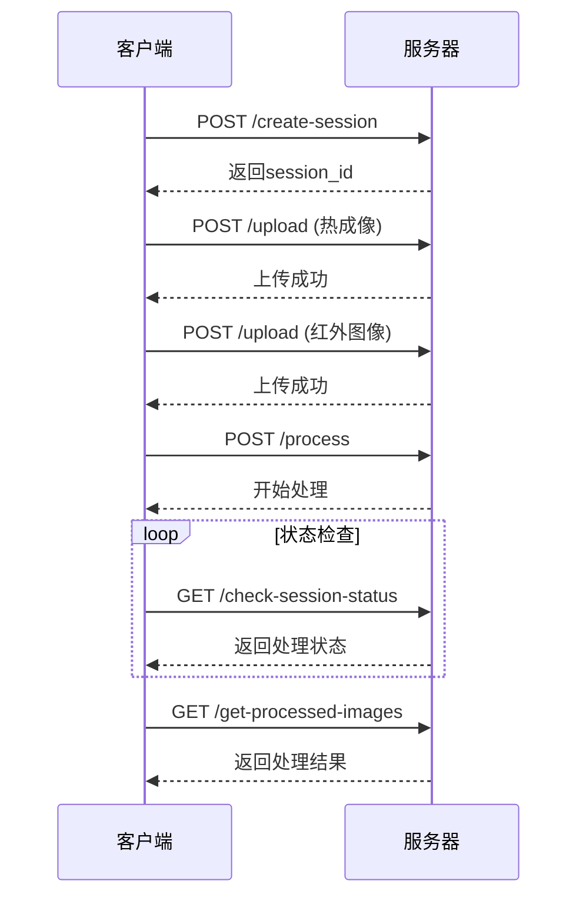

### 3.8 错误处理

#### 3.8.1 通用错误响应
```json
{
    "status": "error",
    "message": "错误描述",
    "error": {
        "code": "ERROR_CODE",
        "details": "详细错误信息"
    }
}
```

#### 3.8.2 常见错误码
| 错误码 | 说明 | 处理建议 |
|--------|------|----------|
| INVALID_SESSION | 无效的会话ID | 重新创建会话 |
| MISSING_IMAGES | 缺少必要的图像 | 确保上传所有必要图像 |
| PROCESSING_ERROR | 处理过程出错 | 检查图像格式是否正确 |
| FILE_NOT_FOUND | 文件不存在 | 检查文件路径 |

### 3.9 安全考虑

#### 3.9.1 接口安全
- 所有接口支持HTTPS
- 实现请求频率限制
- 文件上传大小限制
- 文件类型验证

#### 3.9.2 数据安全
- 会话超时机制
- 定期清理临时文件
- 敏感信息加密存储

## 4. 处理流程

### 4.1 完整Pipeline

#### 4.1.1 处理流程图
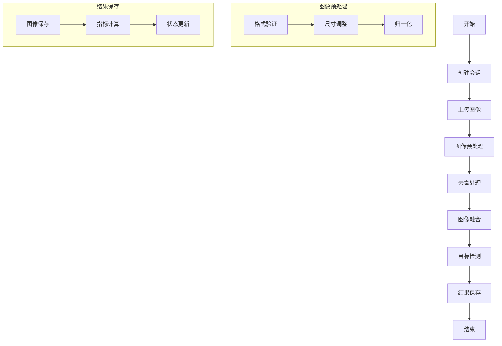

#### 4.1.2 处理步骤说明
1. **会话创建**
   - 生成唯一会话ID
   - 初始化会话状态
   - 创建必要的存储目录

2. **图像上传**
   - 验证图像格式和大小
   - 保存原始图像
   - 更新会话状态

3. **图像预处理**
   - 格式转换和验证
   - 尺寸标准化
   - 数据归一化

4. **去雾处理**
   - 加载去雾模型
   - 执行去雾算法
   - 保存中间结果

5. **图像融合**
   - 特征提取
   - 多尺度融合
   - 结果优化

6. **目标检测**
   - 模型推理
   - 后处理
   - 结果可视化

7. **结果保存**
   - 保存处理结果
   - 计算评估指标
   - 更新会话状态

### 4.2 数据流转

#### 4.2.1 数据流转图
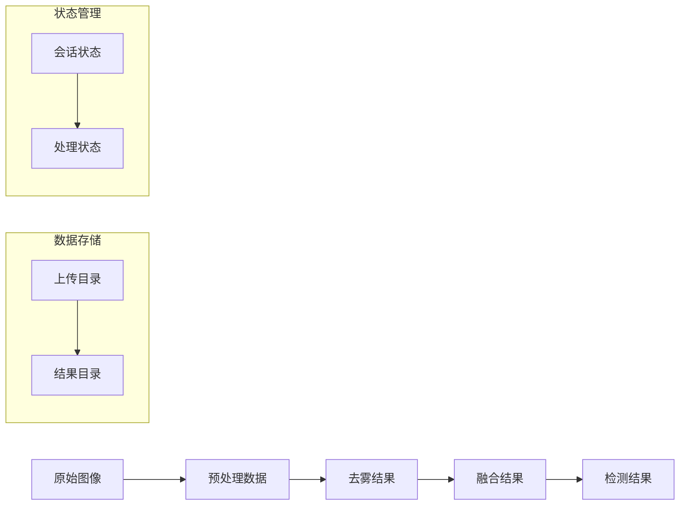

#### 4.2.2 数据格式说明
1. **输入数据**
   - 热成像：RGB格式，分辨率≥640x480
   - 红外图像：RGB格式，分辨率≥640x480

2. **中间数据**
   - 去雾结果：RGB格式，保持原始分辨率
   - 融合结果：RGB格式，保持原始分辨率

3. **输出数据**
   - 检测结果：RGB格式，包含检测框和标签
   - 评估指标：JSON格式，包含各项指标数据

### 4.3 状态管理

#### 4.3.1 状态流转图
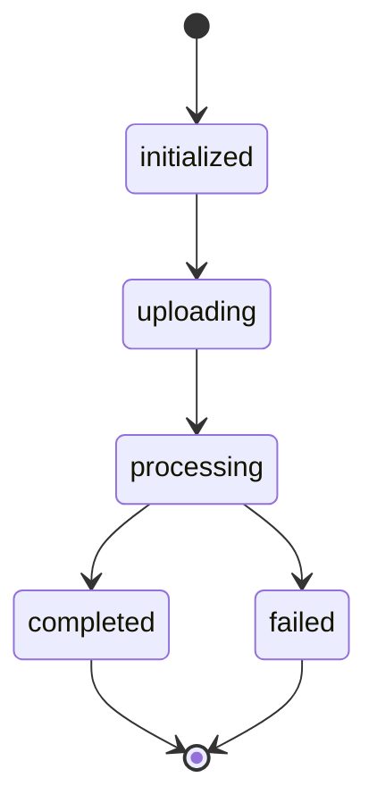

#### 4.3.2 状态说明
| 状态 | 说明 | 可执行操作 |
|------|------|------------|
| initialized | 会话已创建 | 上传图像 |
| uploading | 图像上传中 | 等待完成 |
| processing | 处理进行中 | 查询状态 |
| completed | 处理完成 | 获取结果 |
| failed | 处理失败 | 查看错误 |

### 4.4 错误处理

#### 4.4.1 错误处理流程
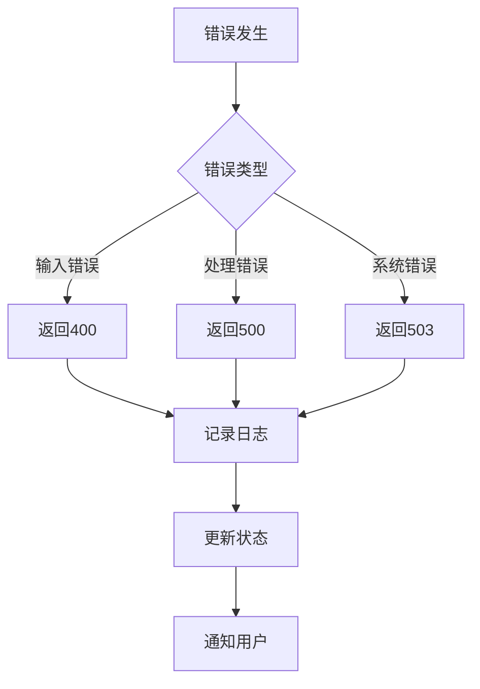

#### 4.4.2 错误恢复机制
1. **输入验证**
   - 文件格式检查
   - 大小限制检查
   - 内容完整性验证

2. **处理异常**
   - 模型加载失败处理
   - 内存溢出处理
   - 超时处理

3. **系统异常**
   - 磁盘空间不足处理
   - 权限问题处理
   - 网络中断处理

### 4.5 性能优化

#### 4.5.1 处理优化
1. **并行处理**
   - 多线程图像预处理
   - GPU加速模型推理
   - 异步结果保存

2. **内存优化**
   - 流式处理大文件
   - 及时释放资源
   - 内存使用监控

3. **存储优化**
   - 临时文件管理
   - 结果文件压缩
   - 定期清理机制

#### 4.5.2 性能指标
| 指标 | 目标值 | 说明 |
|------|--------|------|
| 处理时间 | <5s | 单张图像完整处理时间 |
| 内存使用 | <2GB | 峰值内存使用量 |
| 并发处理 | >10 | 同时处理会话数 |
| 响应时间 | <100ms | API响应时间 |

### 4.6 监控和日志

#### 4.6.1 监控指标
1. **系统指标**
   - CPU使用率
   - 内存使用率
   - GPU使用率
   - 磁盘使用率

2. **处理指标**
   - 处理时间
   - 成功率
   - 错误率
   - 队列长度

#### 4.6.2 日志记录
```python
# 日志格式示例
{
    "timestamp": "2024-03-20T10:00:00Z",
    "session_id": "550e8400-e29b-41d4-a716-446655440000",
    "level": "INFO",
    "module": "dehazing",
    "message": "处理完成",
    "metrics": {
        "processing_time": 1.234,
        "memory_usage": 1024
    }
}
```

#### 4.7.1 模块扩展
1. **新算法集成**
   - 标准化接口
   - 配置化管理
   - 动态加载

2. **新功能添加**
   - 插件化架构
   - 事件驱动
   - 配置热更新

#### 4.7.2 部署扩展
1. **水平扩展**
   - 负载均衡
   - 会话共享
   - 状态同步

2. **垂直扩展**
   - 资源动态分配
   - 性能监控
   - 自动扩缩容
