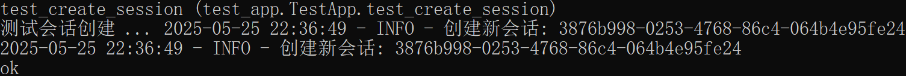
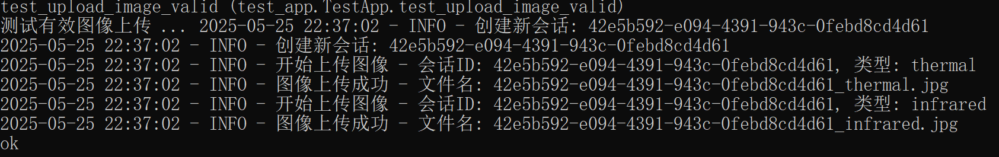
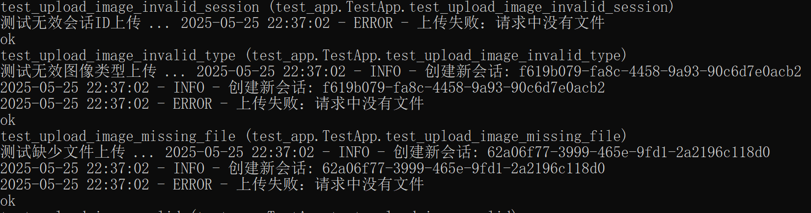
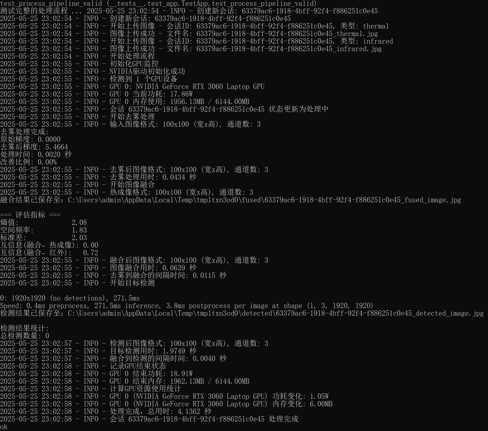
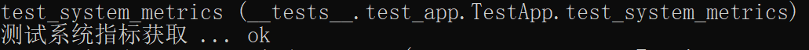

# EmberHunter Backend Unit Testing Report

[TOC]

## 1. Test Overview

### 1.1 Test Objectives

- Verify the functional correctness of backend APIs
- Ensure the reliability of the image processing pipeline
- Validate session management mechanisms
- Test system resource monitoring features
- Ensure the effectiveness of error handling mechanisms

### 1.2 Test Environment

- Python 3.12.4
- Flask 2.3.2
- Dependencies:
  - flask-cors
  - opencv-python
  - numpy
  - Pillow
  - psutil
  - pynvml

## 2. Test Case Design

### 2.1 Basic Functionality Tests

#### 2.1.1 Root Route Test

- Test Case: `test_index`
- Description: Access the root route "/"
- Expected Result:
  - Status Code: 200
  - Response Content: "Backend is running!"

#### 2.1.2 Session Management Test

- Test Case: `test_create_session`
- Description: Create a new session
- Expected Result:
  - Status Code: 200
  - Response contains: `session_id` and a success message

### 2.2 File Upload Tests

#### 2.2.1 Valid Image Upload

- Test Case: `test_upload_image_valid`
- Description:
  1. Upload thermal image
  2. Upload infrared image
- Expected Result:
  - Status Code: 200
  - Response contains: `filename`

#### 2.2.2 Exception Cases

- Test Cases:
  1. `test_upload_image_invalid_session`
  2. `test_upload_image_missing_file`
  3. `test_upload_image_invalid_type`
- Description:
  1. Invalid session ID
  2. Missing file
  3. Invalid image type
- Expected Result:
  - Status Code: 400
  - Response contains: error message

### 2.3 Image Processing Tests

#### 2.3.1 Full Processing Pipeline

- Test Case: `test_process_pipeline_valid`
- Description:
  1. Create session
  2. Upload both images
  3. Execute processing
- Expected Result:
  - Status Code: 200
  - Response contains: processing result message

#### 2.3.2 Retrieve Processing Results

- Test Case: `test_get_processed_images`
- Description: Retrieve processed image information
- Expected Result:
  - Status Code: 200
  - Response contains:
    - `combinedImage`
    - `dehazingImage`
    - `fusingImage`
    - `metrics`
    - `status`

### 2.4 System Monitoring Tests

#### 2.4.1 Retrieve System Metrics

- Test Case: `test_system_metrics`
- Description: Retrieve system resource usage
- Expected Result:
  - Status Code: 200
  - Response contains:
    - CPU usage
    - Memory usage
    - GPU information

## 3. Test Execution Results

### 3.1 Basic Functionality Tests

#### 3.1.1 Root Route Test

#### 3.1.2 Session Management Test

### 3.2 File Upload Tests

#### 3.2.1 Valid Image Upload

#### 3.2.2 Exception Cases

### 3.3 Image Processing Tests

#### 3.3.1 Full Processing Pipeline

#### 3.3.2 Retrieve Processing Results

### 3.4 System Monitoring Tests

#### 3.4.1 Retrieve System Metrics

## 4. Test Environment Management

### 4.1 Test Data Preparation

- Automatically create test images
- Use temporary directory to store test data
- Automatically clean up after tests

### 4.2 Test Environment Configuration

- Use Flask test client
- Configure temporary file directory
- Simulate file upload environment

## 5. Issue Tracking

### 5.1 Resolved Issues

1. Fixed data structure validation issue in `test_get_processed_images`
   - Issue: Expected 'images' field not present
   - Solution: Updated test case to match the actual API response structure

### 5.2 Areas for Improvement

1. Add more boundary condition tests
2. Add performance test cases
3. Improve error handling test coverage
4. Add concurrent test scenarios

## 6. Suggestions and Improvements

### 6.1 Testing Improvements

1. Add more boundary condition test cases
2. Implement performance benchmarking tests
3. Add concurrent testing scenarios
4. Add more exception test cases

### 6.2 System Improvements

1. Optimize image processing performance
2. Enhance error handling mechanisms
3. Improve resource monitoring methods
4. Improve the logging system