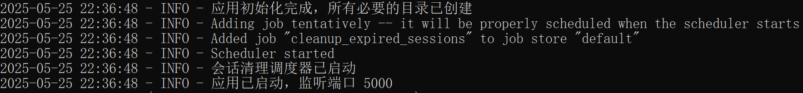
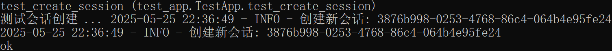
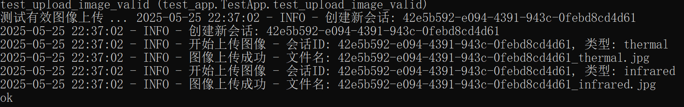
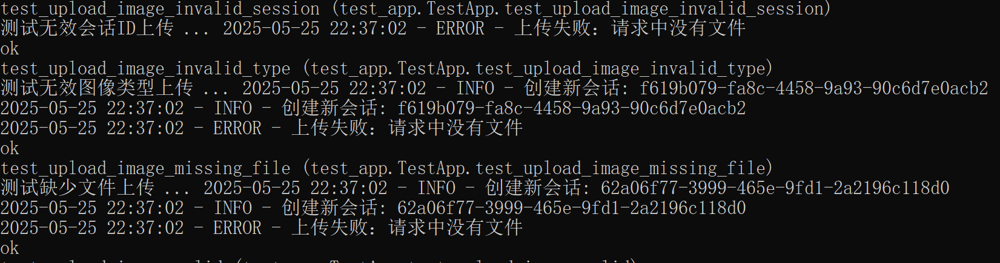
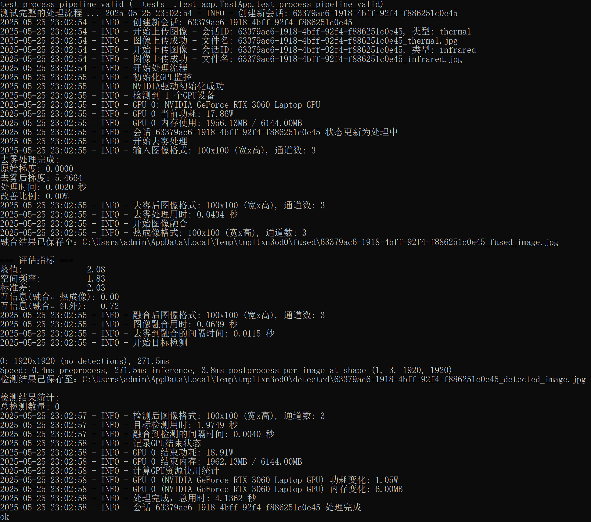
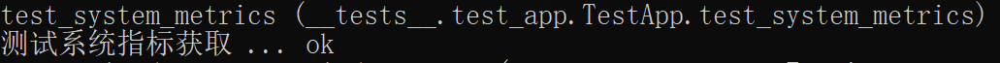

# EmberHunter 后端单元测试报告

## 1. 测试概述

### 1.1 测试目标
- 验证后端API的功能正确性
- 确保图像处理流程的可靠性
- 验证会话管理机制
- 测试系统资源监控功能
- 确保错误处理机制的有效性

### 1.2 测试环境
- Python 3.12.4
- Flask 2.3.2
- 依赖包：
  - flask-cors
  - opencv-python
  - numpy
  - Pillow
  - psutil
  - pynvml

## 2. 测试用例设计

### 2.1 基础功能测试

#### 2.1.1 根路由测试
- 测试用例：`test_index`
- 测试内容：访问根路由 "/"
- 预期结果：
  - 状态码：200
  - 响应内容："Backend is running!"

#### 2.1.2 会话管理测试
- 测试用例：`test_create_session`
- 测试内容：创建新会话
- 预期结果：
  - 状态码：200
  - 响应包含：session_id 和成功消息

### 2.2 文件上传测试

#### 2.2.1 有效图像上传
- 测试用例：`test_upload_image_valid`
- 测试内容：
  1. 上传热成像图像
  2. 上传红外图像
- 预期结果：
  - 状态码：200
  - 响应包含：filename

#### 2.2.2 异常情况测试
- 测试用例：
  1. `test_upload_image_invalid_session`
  2. `test_upload_image_missing_file`
  3. `test_upload_image_invalid_type`
- 测试内容：
  1. 无效会话ID
  2. 缺少文件
  3. 无效图像类型
- 预期结果：
  - 状态码：400
  - 响应包含：error信息

### 2.3 图像处理测试

#### 2.3.1 完整处理流程
- 测试用例：`test_process_pipeline_valid`
- 测试内容：
  1. 创建会话
  2. 上传两种图像
  3. 执行处理
- 预期结果：
  - 状态码：200
  - 响应包含：处理结果消息

#### 2.3.2 处理结果获取
- 测试用例：`test_get_processed_images`
- 测试内容：获取处理后的图像信息
- 预期结果：
  - 状态码：200
  - 响应包含：
    - combinedImage
    - dehazingImage
    - fusingImage
    - metrics
    - status

### 2.4 系统监控测试

#### 2.4.1 系统指标获取
- 测试用例：`test_system_metrics`
- 测试内容：获取系统资源使用情况
- 预期结果：
  - 状态码：200
  - 响应包含：
    - cpu使用率
    - 内存使用率
    - GPU信息

## 3. 测试执行结果
### 3.1 基础功能测试
#### 3.1.1 根路由测试

#### 3.1.2 会话管理测试

### 3.2 文件上传测试

#### 3.2.1 有效图像上传 

#### 3.2.2 异常情况测试

### 3.3 图像处理测试

#### 3.3.1 完整处理流程

#### 3.3.2 处理结果获取

### 3.4 系统监控测试

#### 3.4.1 系统指标获取

## 4. 测试环境管理

### 4.1 测试数据准备
- 自动创建测试图像
- 使用临时目录存储测试数据
- 测试完成后自动清理

### 4.2 测试环境配置
- 使用Flask测试客户端
- 配置临时文件目录
- 模拟文件上传环境

## 5. 问题跟踪

### 5.1 已修复问题
1. 修复了`test_get_processed_images`测试用例中的数据结构验证问题
   - 问题：期望的'images'字段不存在
   - 解决方案：更新测试用例以匹配实际的API响应结构

### 5.2 待优化项目
1. 增加更多边界条件测试
2. 添加性能测试用例
3. 完善错误处理测试
4. 增加并发测试场景

## 6. 建议和改进

### 6.1 测试改进建议
1. 添加更多边界条件测试用例
2. 实现性能基准测试
3. 增加并发测试场景
4. 添加更多异常情况测试

### 6.2 系统改进建议
1. 优化图像处理性能
2. 增强错误处理机制
3. 改进资源监控方式
4. 完善日志记录系统
